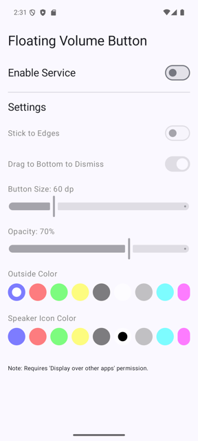
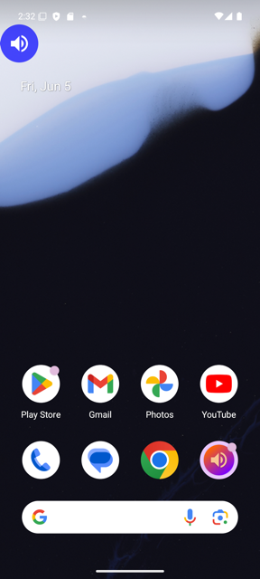
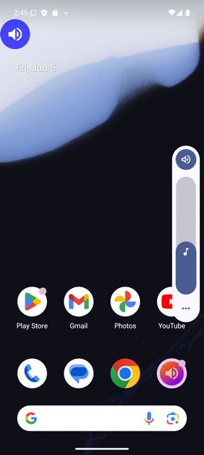

# Floating Volume Button

An Android app that puts a draggable, always-on-top volume button on your screen. Tap it to bring up the system volume panel from anywhere — handy when the physical volume keys are awkward to reach or broken.

## Screenshots

| Settings | Floating button | Volume panel on tap |
| :---: | :---: | :---: |
|  |  |  |

## Features

- **Floating overlay button** — a circular speaker button that floats over other apps and stays on top.
- **Tap to adjust volume** — tapping shows the system media-volume slider so you can change it without the hardware keys.
- **Drag anywhere** — move the button freely around the screen; its position is remembered between launches.
- **Stick to edges** — optionally snap the button to the nearest screen edge when you let go.
- **Drag to dismiss** — drag the button to the dismiss target at the bottom of the screen to turn the service off.
- **Customizable appearance** — adjust the button size (40–120 dp), opacity (10–100%), outer color, and speaker-icon color.
- **Orientation aware** — repositions sensibly when the screen rotates and respects display cutouts and the status bar.
- **Haptic feedback** — subtle vibrations when dragging, snapping, and dismissing.
- **Foreground service** — runs as a low-priority foreground service with a persistent notification so it isn't killed.

## How it works

- `MainActivity` is the settings screen (Jetpack Compose). It toggles the service and exposes all appearance/behavior settings.
- `FloatingVolumeService` is a foreground service that draws the button via a `WindowManager` overlay (`TYPE_APPLICATION_OVERLAY`) and calls `AudioManager.adjustStreamVolume(...)` to show the volume UI.
- `PreferencesManager` persists settings and the button's last position in `SharedPreferences`, exposed as `StateFlow`s the UI and service observe.
- `ui/FloatingButton.kt` is the Compose button with its drag/tap gestures.

## Requirements

- Android 12 (API 31) or newer.
- **Display over other apps** permission (`SYSTEM_ALERT_WINDOW`). The app prompts for this the first time you enable the service.
- Notification permission is requested for the foreground-service notification.

## Building

This is a standard Gradle Android project. From the project root:

```bash
# Debug build
./gradlew assembleDebug

# Install on a connected device/emulator
./gradlew installDebug

# Release build (minified + resource shrinking enabled)
./gradlew assembleRelease
```

Or open the project in Android Studio and run the `app` configuration.

## Usage

1. Launch the app and toggle **Enable Service** on.
2. Grant the *Display over other apps* permission when prompted, then re-toggle if needed.
3. The floating button appears. Tap it to show the volume slider; drag it to reposition.
4. Tweak size, opacity, colors, edge-snapping, and drag-to-dismiss from the settings screen.
5. Toggle the service off (or drag the button to the bottom dismiss target) to remove it.

## Tech stack

- Kotlin + Jetpack Compose (Material 3)
- `WindowManager` overlay with a Compose `ComposeView`
- Foreground service (`specialUse` type)
- `SharedPreferences` + Kotlin `StateFlow`
